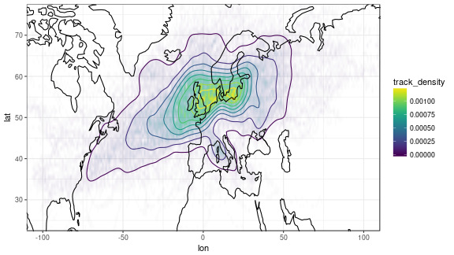

# Storm tracking for Real Projections

An R package to analyse and plot storm tracks and storm track density from reanalyses and climate model data.

The package uses `data.table` and `ggplot2` for fast computation and high quality graphics.


## Installation


```r
devtools::install_github('sieste/realstorms')
library(realstorms)
```


## Usage example

We are working with files of standard ascii output format produced by the
[TRACK storm tracking
software](http://www.nerc-essc.ac.uk/~kih/TRACK/Track.html). (Currently, no data is included with the package, but will soon be.)


```r
stormsfile = 'storms.txt'
writeLines(readLines(stormsfile, n=8))
```

```
## 0
## PER_INFO 1    186.00000
## 0 0
## TRACK_NUM      1184 ADD_FLD    6  16 &111110
## TRACK_ID  127 START_TIME 1979100312
## POINT_NUM  30
## 1979100312 353.681549 47.666767 2.346363e+00 & 3.533451e+02 & 4.970964e+01 & 1.007385e+03 & 7.031000e-01 & 4.526300e+01 & 1.215763e+01 & 3.550781e+02 & 4.666655e+01 & 1.042684e+00 & 3.529688e+02 & 5.087706e+01 & -7.438669e-01 & 7.031000e-01 & 4.526300e+01 & 1.215763e+01 & 1.157416e-01 & 
## 1979100315 354.703278 48.574390 2.604560e+00 & 3.537430e+02 & 5.029348e+01 & 1.006312e+03 & 1.406200e+00 & 4.526300e+01 & 1.209936e+01 & 3.557812e+02 & 4.807005e+01 & 1.145681e+00 & 3.529688e+02 & 5.087706e+01 & -9.429607e-01 & 1.406200e+00 & 4.526300e+01 & 1.209936e+01 & 1.584442e-01 &
```

The function `read_tracks` parses TRACK output into a `data.table`. Variable names can be passed as a function argument:


```r
trx = read_tracks(stormsfile, var=c('vor850', 'mslp', 'speed', 'precip', 'omega'))
head(trx)
```

```
##                ID       date lon_vor850 lat_vor850 var_vor850 lon_mslp
## 1: 1979100312_127 1979100312  -6.318451   47.66677   2.346363  -6.6549
## 2: 1979100312_127 1979100315  -5.296722   48.57439   2.604560  -6.2570
## 3: 1979100312_127 1979100318  -4.857239   49.65100   2.899219  -5.9150
## 4: 1979100312_127 1979100321  -4.318573   50.21724   3.184141  -5.9635
## 5: 1979100312_127 1979100400  -4.361511   51.63484   3.541903  -5.4617
## 6: 1979100312_127 1979100403  -3.812408   52.54179   3.929281  -4.9509
##    lat_mslp var_mslp lon_speed lat_speed var_speed lon_precip lat_precip
## 1: 49.70964 1007.385    0.7031   45.2630  12.15763    -4.9219   46.66655
## 2: 50.29348 1006.312    1.4062   45.2630  12.09936    -4.2188   48.07005
## 3: 50.62696 1004.724    1.4062   45.9648  13.09993    -6.3281   51.57881
## 4: 51.28530 1003.757    2.8125   46.6665  15.49924    -6.3281   52.98231
## 5: 51.55520 1001.974   -7.7344   51.5788  14.98526    -5.6250   52.98231
## 6: 52.19911 1000.530    0.7031   57.1928  15.12454    -7.0312   52.28056
##    var_precip lon_omega lat_omega  var_omega  lon_V6  lat_V6   var_V6
## 1:   1.042684   -7.0312  50.87706 -0.7438669  0.7031 45.2630 12.15763
## 2:   1.145681   -7.0312  50.87706 -0.9429607  1.4062 45.2630 12.09936
## 3:   1.333872   -7.0312  51.57881 -1.0721690  1.4062 45.9648 13.09993
## 4:   1.780192   -7.0312  52.28056 -1.3256610  2.8125 46.6665 15.49924
## 5:   2.081553   -7.0312  51.57881 -1.0744200 -7.7344 52.2806 14.71069
## 6:   2.893448   -6.3281  55.08756 -1.0830790 -7.0312 52.2806 15.01214
##       var_V7
## 1: 0.1157416
## 2: 0.1584442
## 3: 0.1752217
## 4: 0.2139297
## 5: 0.2372818
## 6: 0.4409288
```


The function `track_density` splits the world up into grid boxes of width and height `bw` (in degrees) and calculates track count, track density, feature count and feature density:


```r
# calculate track density on a 5x5 degree grid
td = track_density(trx, bw=1)
head(td)
```

```
##                      bin feature_count track_count feature_density
## 1: (-180,-179],(-90,-89]             0           0               0
## 2: (-179,-178],(-90,-89]             0           0               0
## 3: (-178,-177],(-90,-89]             0           0               0
## 4: (-177,-176],(-90,-89]             0           0               0
## 5: (-176,-175],(-90,-89]             0           0               0
## 6: (-175,-174],(-90,-89]             0           0               0
##    track_density lon_min lon_max lat_min lat_max    lon   lat
## 1:             0    -180    -179     -90     -89 -179.5 -89.5
## 2:             0    -179    -178     -90     -89 -178.5 -89.5
## 3:             0    -178    -177     -90     -89 -177.5 -89.5
## 4:             0    -177    -176     -90     -89 -176.5 -89.5
## 5:             0    -176    -175     -90     -89 -175.5 -89.5
## 6:             0    -175    -174     -90     -89 -174.5 -89.5
```

The object `trx` is of class `stormtracks`, and the object `td` is of class `track_density`. Both classes have S3 plotting methods:


```r
plot(trx, var='vor850')
```


```r
plot(td, what='track_density', contour_smooth=2) + 
coord_cartesian(xlim=c(-100,100), ylim=c(25,75))
```




